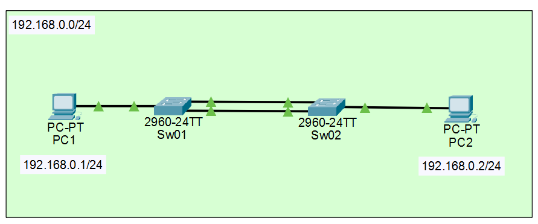

# リングアグリゲーション（ケーブルの冗長化）

### 手順書：EtherChannel＋VLAN2でPC間ping疎通（Packet Tracer / 2960想定）

### 0-1. 前提構成

* PC1 — Sw01（例：Fa0/1）
* Sw01（Fa0/2, Fa0/3）＝＝＝ Sw02（Fa0/2, Fa0/3） ※2本で束ねる
* Sw02（例：Fa0/1）— PC2
* VLAN：2 を使用
* EtherChannel：Port-channel 1（LACP）

### 0-2. 構成図
PC1                          Sw01                       Sw02                          PC2
IP: 192.168.0.1/24      2960-24TT                 2960-24TT                    IP: 192.168.0.2/24
      |                 +-----------+             +-----------+                       |
      | Fa0             | Fa0/1     |             | Fa0/1     |                       | Fa0
      +-----------------| Access V2 |             | Access V2 |-----------------------+
                        |           |             |           |
                        | Fa0/2  ---+=============+---  Fa0/2 |
                        | Fa0/3  ---+   Po1(LACP) +---  Fa0/3 |
                        |           |   Access V2  |           |
                        +-----------+=============+-----------+

凡例：
  - 「===」は EtherChannel（Port-channel1）で束ねたリンク（Fa0/2 + Fa0/3）
  - PC接続ポート（両端 Fa0/1）は access VLAN 2
  - Po1 も access VLAN 2（今回は “単一VLANを運ぶ” 構成）



---


### 1. PCのIP設定（同一セグメント）

Packet Tracer：PC → **Desktop** → **IP Configuration**

例）

* **PC1**：`192.168.0.1` / `255.255.255.0`
* **PC2**：`192.168.0.2` / `255.255.255.0`
* **Default Gateway**：未設定でOK（ルータが無いので）

---

### 2. Sw01 設定

#### 2-1. VLAN2作成

```bash
enable
conf t
vlan 2
exit
```

#### 2-2. PC1接続ポートを VLAN2（access）に設定（例：Fa0/1）

```bash
interface fa0/1
 switchport mode access
 switchport access vlan 2
 no shut
exit
```

#### 2-3. Sw02接続の2本を EtherChannel（LACP active）＋VLAN2（access）に設定（例：Fa0/2, Fa0/3）

```bash
interface range fa0/2, fa0/3
 switchport mode access
 switchport access vlan 2
 channel-group 1 mode active
 no shut
exit
```

#### 2-4. Port-channel側も VLAN2（access）に統一

```bash
interface port-channel 1
 switchport mode access
 switchport access vlan 2
 no shut
end
```

---

### 3. Sw02 設定

##### 3-1. VLAN2作成

```bash
enable
conf t
vlan 2
exit
```

##### 3-2. PC2接続ポートを VLAN2（access）に設定（例：Fa0/1）

```bash
interface fa0/1
 switchport mode access
 switchport access vlan 2
 no shut
exit
```

##### 3-3. Sw01接続の2本を EtherChannel（LACP active）＋VLAN2（access）に設定（例：Fa0/2, Fa0/3）

```bash
interface range fa0/2 - 3
 switchport mode access
 switchport access vlan 2
 channel-group 1 mode active
 no shut
exit
```

##### 3-4. Port-channel側も VLAN2（access）に統一

```bash
interface port-channel 1
 switchport mode access
 switchport access vlan 2
 no shut
end
```

---

### 4. 動作確認

##### 4-1. VLAN所属確認（PCポートが VLAN2 になってるか）

```bash
show vlan brief
```

* Fa0/1 が VLAN2 の一覧に入っていればOK

##### 4-2. EtherChannel束ね確認（両端）

```bash
show etherchannel summary
```

目安：

* `Po1(SU)`（S=Layer2 / U=in use）
* `Fa0/2(P) Fa0/3(P)`（P=port-channel参加中）

##### 4-3. STPで Po1 が VLAN2 に出ているか

```bash
show spanning-tree vlan 2
```

目安：一覧に `Po1` が表示される（FWD など）

---

### 5. 疎通確認（ping）

PC1 → Command Prompt：

```bash
ping 192.168.0.2
```

成功すればOK。

---

### ☆よくあるハマりポイント（原因と対処）

##### ① VLANを作っただけで疎通しない

**原因**：PCが刺さっているスイッチポート（Fa0/1など）が VLAN2 に入ってない
**対処**：`switchport access vlan 2` を PCポートに設定する

##### ② EtherChannelが束ねられない / suspended になる

**原因**：両端で LACP設定が不一致（active/passive/none など）
**対処**：両端とも `channel-group 1 mode active` に統一

##### ③ CDP Native VLAN mismatch が出る

**原因**：どこかが trunk 扱いになっていて、ネイティブVLANがズレてる
**対処**：今回のaccess運用なら、メンバ/Po1を **両端とも access VLAN2 に固定**（手順通りでOK）

---
