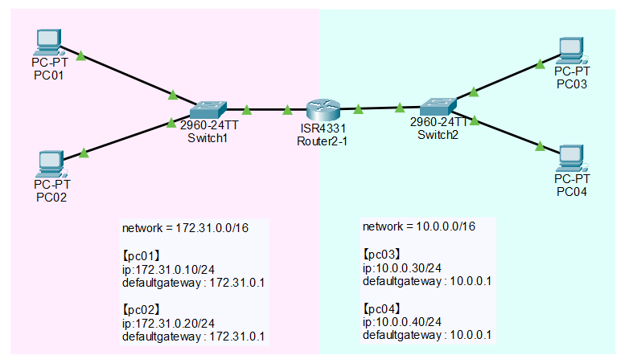

# 演習2
PC01, PC02はネットワーク172.31.0.0/24に所属しています。

PC03, PC04はネットワーク10.0.0.0/24に所属しています。

[PC01, PC02]-[PC03, PC04]間がそれぞれ通信できるようにネットワークを組んでみましょう。

---

## 1. ネットワーク構成（固定）

### 1-1. 接続
- 172.31.0.0/24 側  
  - PC01 ↔ sw1 Fa0/1  
  - PC02 ↔ sw1 Fa0/2  
  - sw1 ↔ rt0 Gi0/0/0
- 10.0.0.0/24 側  
  - PC03 ↔ sw2 Fa0/1  
  - PC04 ↔ sw2 Fa0/2  
  - sw2 ↔ rt0 Gi0/0/1

> 注意：ルータの **Gi0/0/0 側に sw1**、**Gi0/0/1 側に sw2** を必ず接続する



---

### 1-2. アドレス設計（表記ゆれ修正済み）
- rt0（ルータ）
  - Gi0/0/0：`172.31.0.1/24`
  - Gi0/0/1：`10.0.0.1/24`
- PC01：`172.31.0.10/24`
  - Default Gateway：`172.31.0.1`
- PC02：`172.31.0.20/24`
  - Default Gateway：`172.31.0.1`
- PC03：`10.0.0.30/24`
  - Default Gateway：`10.0.0.1`
- PC04：`10.0.0.40/24`
  - Default Gateway：`10.0.0.1`

---

### 1-3. ゴール
- PC01 ↔ PC03 の ping が成功（双方向）
- PC02 ↔ PC04 の ping が成功（双方向）

---

## 2. PCのIP設定（Packet Tracer）
操作：PC → **Desktop** → **IP Configuration**

### 2-1. 172.31.0.0/24 側
**PC01**
- IP Address：`172.31.0.10`
- Subnet Mask：`255.255.255.0`
- Default Gateway：`172.31.0.1`

**PC02**
- IP Address：`172.31.0.20`
- Subnet Mask：`255.255.255.0`
- Default Gateway：`172.31.0.1`

### 2-2. 10.0.0.0/24 側
**PC03**
- IP Address：`10.0.0.30`
- Subnet Mask：`255.255.255.0`
- Default Gateway：`10.0.0.1`

**PC04**
- IP Address：`10.0.0.40`
- Subnet Mask：`255.255.255.0`
- Default Gateway：`10.0.0.1`

### 2-3. PC側確認（必須）
各PC：Desktop → **Command Prompt** で実行

```text
ipconfig
```

確認ポイント：
- IP / Mask / Default Gateway が設計通り

---

## 3. ルータ設定（rt0）

### 3-1. 特権EXEC → グローバル設定
```ios
Router> enable
Router# configure terminal
```

### 3-2. Gi0/0/0（172.31.0.0/24側）の設定
```ios
Router(config)# interface gigabitEthernet 0/0/0
Router(config-if)# ip address 172.31.0.1 255.255.255.0
Router(config-if)# no shutdown
```

### 3-3. Gi0/0/1（10.0.0.0/24側）の設定
```ios
Router(config)# interface gigabitEthernet 0/0/1
Router(config-if)# ip address 10.0.0.1 255.255.255.0
Router(config-if)# no shutdown
Router(config-if)# end
```

### 3-4. IF状態確認（必須）
```ios
Router# show ip interface brief
```

期待：
```text
GigabitEthernet0/0/0   172.31.0.1  YES manual  up  up
GigabitEthernet0/0/1   10.0.0.1    YES manual  up  up
```

### 3-5. ルーティング確認（推奨）
この演習は **静的ルート不要**。rt0 が両ネットワークに直結しているため。

```ios
Router# show ip route
```

期待イメージ：
- `C 172.31.0.0/24 is directly connected, GigabitEthernet0/0/0`
- `C 10.0.0.0/24 is directly connected, GigabitEthernet0/0/1`

---

## 4. スイッチ設定（基本は不要・確認だけでOK）
本演習は VLAN を分けない想定（各スイッチが1セグメントのみ）。通常は初期状態（VLAN1/access）でOK。

### 4-1. ポート状態確認（推奨）
sw1 / sw2 それぞれで確認：

```ios
Switch# show interface status
```

または

```ios
Switch# show ip interface brief
```

### 4-2. もし down なら（稀）
- ケーブル接続を見直す
- どうしても必要なら該当ポートで `no shutdown`

例：
```ios
Switch# configure terminal
Switch(config)# interface fastEthernet 0/1
Switch(config-if)# no shutdown
Switch(config-if)# end
```

---

## 5. 疎通確認（ping）

### 5-1. まず “同一LAN内” を確認（切り分けの基本）
**PC01 → PC02**
```text
ping 172.31.0.20
```

**PC03 → PC04**
```text
ping 10.0.0.40
```

> ここが失敗する場合：スイッチ配下（L2）かPC設定が原因

### 5-2. 次に “ルータ越え” を確認（ゴール）
**PC01 → PC03**
```text
ping 10.0.0.30
```

**PC03 → PC01**
```text
ping 172.31.0.10
```

**PC02 → PC04**
```text
ping 10.0.0.40
```

**PC04 → PC02**
```text
ping 172.31.0.20
```

補足：
- 1回目はARP解決で落ちることがあるため、**2回実行して成功を確認**

---

## 6. 失敗時の切り分け（最短）
1. **ルータIFが up/up**：`show ip interface brief`
2. **PCのIP/GW**：各PCで `ipconfig`
3. **PC → 自分のGWへ ping**
   - PC01/PC02：`ping 172.31.0.1`
   - PC03/PC04：`ping 10.0.0.1`
4. **同一LAN内の ping**
   - PC01 ↔ PC02
   - PC03 ↔ PC04
5. **ルータのConnectedルートが2本ある**：`show ip route`

---

## 7. 完了条件（チェックリスト）
- [ ] rt0：Gi0/0/0 = 172.31.0.1/24、Gi0/0/1 = 10.0.0.1/24、両方 up/up
- [ ] PC01：172.31.0.10/24 GW 172.31.0.1
- [ ] PC02：172.31.0.20/24 GW 172.31.0.1
- [ ] PC03：10.0.0.30/24 GW 10.0.0.1
- [ ] PC04：10.0.0.40/24 GW 10.0.0.1
- [ ] PC01 ↔ PC03 ping 成功（双方向）
- [ ] PC02 ↔ PC04 ping 成功（双方向）

---